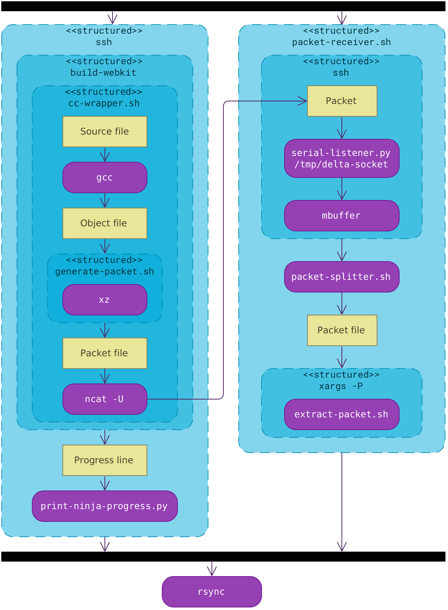

webkit-remote-build is a suite of scripts that enable remote compilation in WebKit.

Its main advantages over other remote compilation tools are:

* It works efficiently over WAN, so you don't need to have your build machine in a super fast wired LAN to use it. You still need a good uplink at the location of your build machine, but for your work laptop most not too bad home broadband connections with a decent downlink will work just fine.

* SSH is the only service you need to expose from your build machine.

* Once it's set you can switch seamlessly between remote and local build. For instance, you may use remote build to get an initial build of webkit and then use local build for incremental changes until you need a rebase or anything heavy.

* It works with both Release and Debug builds, debugging symbols included. A Debug build of WebKit is quite massive, but fortunately it can be compressed quite a bit at the expense of increasing compilation time a bit (the tools that offer the best compression ratios end up doing so at the expense of a lot of CPU time which the compiler and the compression tool compete for).

* It supports separate debug info objects (.dwo files).

* It uses a pipeline design that ensures that all parts of the process (compilation and compression, transfer and decompression) are executed concurrently. In consequence, the whole process only takes as long as the slowest part of it (i.e. if you have a fast network where you can afford low compression settings, remote build takes little more than performing a local build in the build machine).

It works like this:

* Before the process starts, both machines need to have the repository cloned in the same path and `DependenciesGTK` built. They should have the same remotes configured.

* The user must have all their commits pushed to a remote before remote compilation. Local uncommitted changes are OK though (they are sent as a patch file to the build machine).

* The user runs `remote-build.sh build`. This starts the remote compilation process, which spawns two concurrent (high level) processes:

  - A producer: the build machine building source code.
  - A consumer: the local machine decompressing the files.

## The producer (remote machine)

* The build machine receives the current commit hash, branch name and a patch file with uncommited changes from the work laptop and uses them to set the source tree to the same state. This way we don't need to upload .cpp files over slow uplinks.

* The CC, CXX and LD variables are linked to `cc-wrapper.sh` and `Tools/Scripts/build-webkit` is executed. For this purpose, symbolic links with different names are used, in a similar way to ccache and other compiler wrappers.

* `cc-wrapper.sh` calls the inner compiler, e.g. `g++`. Then it checks if it's running in the build machine or in the work laptop. In the former case, it also compresses the object file, wraps it in a packet with some important metadata (file name, modification timestamp, compression method and size) and pushes it through a pipe to the consumer.

  * The compression method is `xz -6` by default, which works fine for me on 17 Mbps and a build machine that would build on 16 minutes (I get a total time of 23 minutes, which is not perfect, but much better than 2 hours and half to 3 hours that I would need otherwise).

  * If you are on a faster network you can choose a faster compression profile to get faster total time. For optimal results you should use the fastest compression method that still allows you download compressed object files as fast as they are compiled.

  * There is an alternative xdelta compression method (my initial approach) that is more efficient than xz in both size and time, but requires synchronizing a "baseline" build tree first from a faster network (using `remote-build.sh sync`). Personally I stopped using it because xz was good enough for me and did not require me to worry about baselines.

* `build-webkit` is piped to `print-ninja-process.py` which shows a progress bar of the overall progress. This is not only useful for regular use, but also for estimating the performance of the compression setting without waiting for the full process to finish.

  Unfortunately, the WebKit ninja files do some things with build progress reporting that make the remaining time calculation inaccurate. For instance, it spawns recursive `ninja` instances which write to the same standard output (this is the reason several progress bars are displayed in an unsatisfying fashion).

## The consumer (work laptop)

* The work laptop receives a contiguous stream of packets from the build machine and splits them into individual files, until a special "end" packet is received. (packet-splitter.sh)

* For every packet received, `extract-packet.sh` is invoked, which parses the packet headers and decompresses the file. This process is parallelized up to the number of CPU threads in the work laptop.

## Concurrency issues

The above explanation is slightly simplified. In particular, it's not explained how the pipe between producer and consumer is created.

Actually `cc-wrapper.sh` writes the packets not directly to the consumer, but to a serializer, `serial-listener.py`, through a write-only UNIX domain socket.

`serial-listener.py` processes only one connection at a time so that packets don't overwrite each other. At its standard output there is a stream of sequential packets.

`serial-listener.py` is executed within ssh and the output of this ssh process is piped to `packet-splitter.sh` from the work laptop, where the consumer starts.

## Final steps

There are some files that are interesting to have but are generated from processes other than gcc and are not wrapped by cc-wrapper, like generated source code. Those are transferred automatically with rsync at the end of the process in an incremental way. Fortunately they don't take too long even if it's the first build.

## Limitations

* Both the build machine and the working laptop must have similar systems, as the object files and other compilation by-products are transferred byte-by-byte.

  - In particular, both computers should have the source code tree in the same directory, as many build systems' byproducts use absolute paths.

  - Also, executables from one machine must be able to run in the other. Unfortunately, this is not always the case across different Linux distributions, so the safest way is to use the same distro (and have it equally updated if it's a rolling release) on both machines.

* The build machine uplink needs to be at least as good as the downlink of the work laptop for best performance. This seems obvious, but unfortunately this is a problem for many people with asymmetric connections at home. If you have a 20/1 Mbps line for the build machine you have at home you will never be able to download faster than 1 Mbps, which is far from enough for debug builds.

* Well... you need a powerful PC to get any advantage from doing remote compilation this way in the first place.

## Remote compilation pipeline

